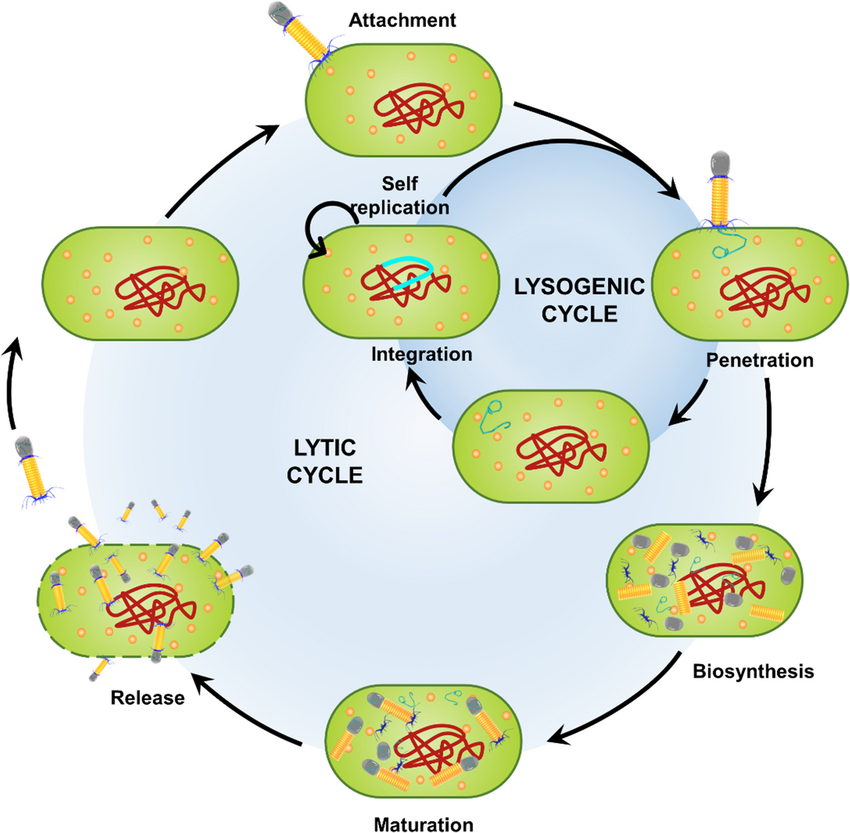
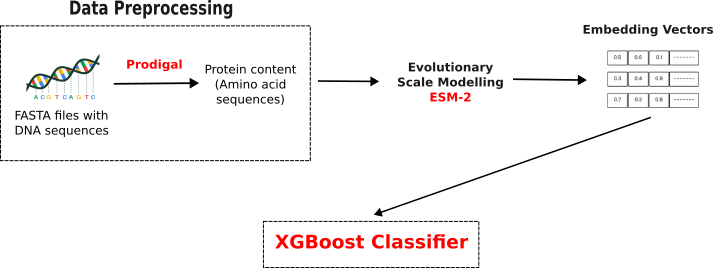

# 🧬 Phage Lifecycle Classification

Welcome to my data science project exploring bacteriophage life cycles using Large Language Models and machine learning. This project was part of the Phagos x AWS hackathon held on the 14th and the 15th of May 2025 [hackathon link](https://hackathon.phagos.org/).

### 📘 Project Notebook

🔗 [View Notebook on GitHub](./phage_lifecycle_hackthon25.ipynb)  

### 📊 Highlights

- Handling fasta files with DNA sequences.
- Used LLMs for proteins (Evolutionary Scale Modelling) to extract embeddings from amino acid sequences.
- Trained an XGBoost classifier to predict the type of lifecycle.
- Achieved ~92% model accuracy
- Visualized model performance with confusion matrices.

### 🔧 Tools Used

- **Biology libraries** : BioPython, Prodigal
- **Data handling and visualization** : Pandas, Matplotlib
- **Deep learning** : fair-esm
- **Machine learning** : XGBoost, scikit-learn

## Bacteriophages

### What are they?

Bacteriophages, or simply phages, are viruses that specifically infect and replicate within bacteria. They are among the most abundant biological entities on Earth, found in environments ranging from soil and oceans to the human gut. It is estimated that the number of bacteriophages is 10 times more than that of bacteria [@HaojieGe].

### Phages in combating Antimicrobial Resistence

Antimicrobial resistance (AMR) is when microorganisms like bacteria, viruses, fungi, or parasites evolve to resist the effects of drugs that were once effective at killing or controlling them. AMR is a natural process that happens over time through genetic changes in pathogens. Its emergence and spread is accelerated by human activity, mainly the misuse and overuse of antimicrobials to treat, prevent or control infections in humans, animals and plants. The World Health Organization has recognised AMR as a "global health crisis", estimated to cause 10 million deaths annually by 2050 if left unchecked [@WHO].

Bacteriophages offer a promising alternative because of their natural ability to infect and kill specific bacteria — including drug-resistant strains.

- **Phage therapy** : This involves applying tailored phage cocktails to infected patients — often as a last resort when antibiotics fail [@phagetherapy]
- **Targeted killing** : Phages infect only specific bacteria, reducing damage to beneficial microbiota (unlike broad-spectrum antibiotics).
- **Evolving Agents** : Phages can co-evolve with bacteria, potentially overcoming resistance mechanisms.

Scientists are developing phage libraries, engineered phages, and phage-antibiotic combinations to improve therapeutic effectiveness and reduce resistance risk. This is still a very active field of research.

### Phage lifecycle

Bacteriophages (phages) follow two main life cycles when infecting bacteria: the **lytic** and **lysogenic cycles**.

- In the **lytic cycle**, a phage takes over the host’s cellular machinery to produce new viral particles, ultimately causing the bacterial cell to burst (lyse) and release the newly formed phages.
- In the **lysogenic cycle**, the phage integrates its DNA into the host genome, allowing it to replicate passively with the host until certain conditions trigger it to enter the lytic phase.

Understanding a phage’s lifecycle is crucial because it determines:

- **Therapeutic potential**: Lytic phages are preferred for phage therapy since they actively kill bacteria.
- **Genetic risk**: Lysogenic phages can transfer genes, including those linked to antibiotic resistance or toxins.

*Figure : Source : [Bacteriophages in nature: recent advances in research tools and diverse environmental and biotechnological applications](https://link.springer.com/article/10.1007/s11356-024-32535-3)*

## Workflow

## References

[@HaojieGe] : https://www.sciencedirect.com/science/article/pii/S0944501319306135#bib0160
[@WHO] : https://www.who.int/news-room/fact-sheets/detail/antimicrobial-resistance
[@phagetherapy] : https://pmc.ncbi.nlm.nih.gov/articles/PMC5547374/#:~:text=Conventionally%2C%20phage%20therapy%20relies%20on,and%20purified%20phage%20lytic%20proteins.

---

_This portfolio was built using [Jekyll](https://jekyllrb.com) and hosted via [GitHub Pages](https://pages.github.com)._ ✨
