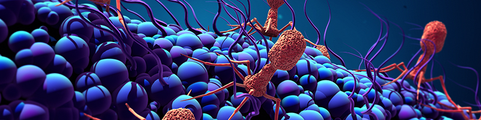

# 🧬 Phage Lifecycle Classification

Welcome to my data science project exploring bacteriophage life cycles using Large Language Models and machine learning. This project was part of the Phagos x AWS hackathon held on the 14th and the 15th of May 2025 (https://hackathon.phagos.org/).

## 📘 Project Notebook

🔗 [View Notebook on GitHub](./phage_lifecycle_hackthon25.ipynb)  

## 📊 Highlights

- Handling fasta files with DNA sequences.
- Used LLMs for proteins (Evolutionary Scale Modelling) to extract embeddings from amino acid sequences.
- Trained an XGBoost classifier to predict the type of lifecycle.
- Achieved ~92% model accuracy
- Visualized model performance with confusion matrices.

## 🔧 Tools Used

- **Biology libraries** : BioPython, Prodigal
- **Data handling and visualization** : Pandas, Matplotlib
- **Deep learning** : fair-esm
- **Machine learning** : XGBoost, scikit-learn 

---

_This portfolio was built using [Jekyll](https://jekyllrb.com) and hosted via [GitHub Pages](https://pages.github.com)._ ✨
